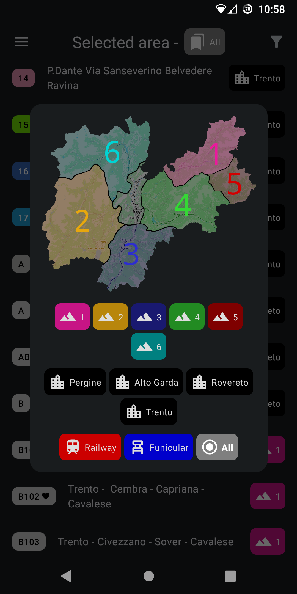
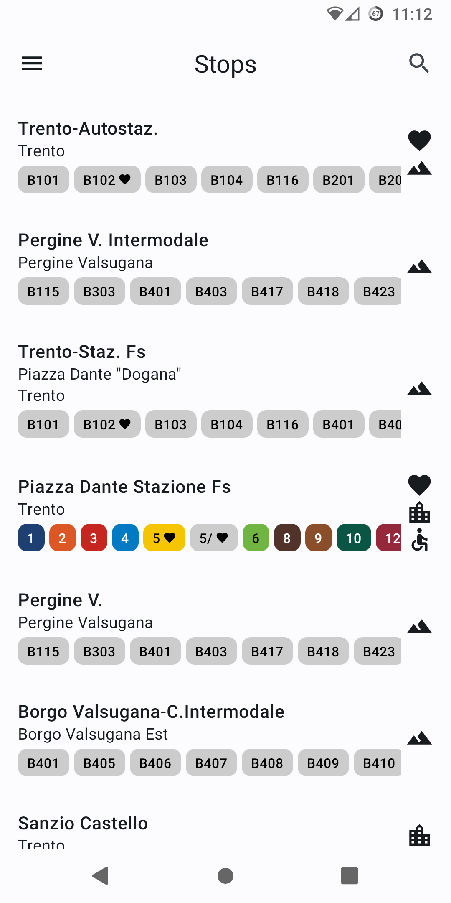
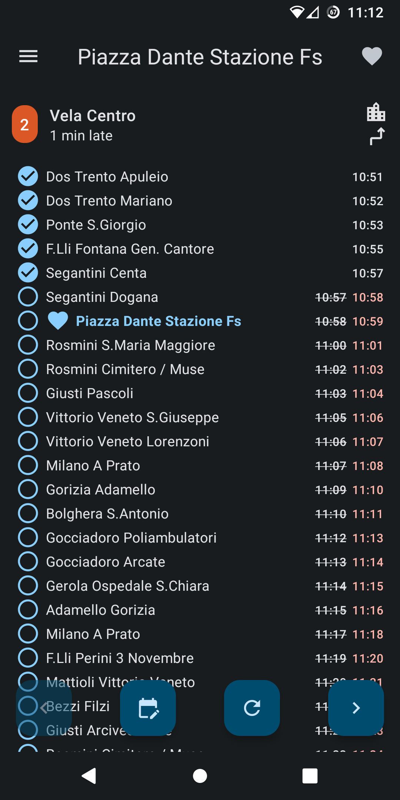
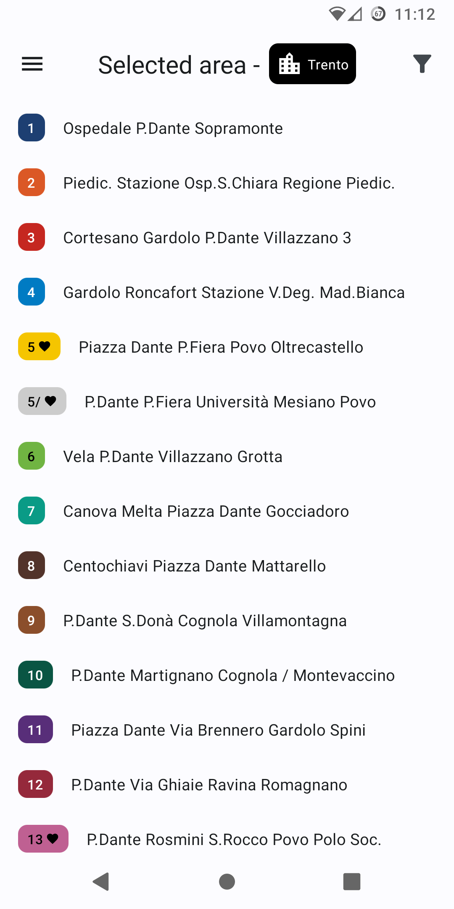
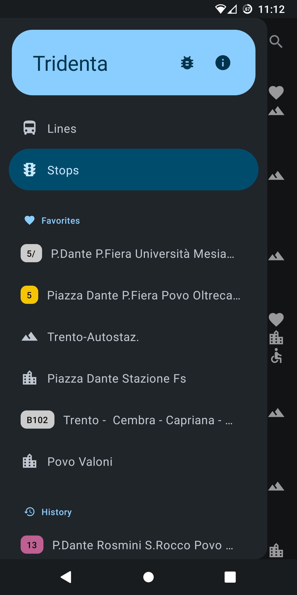
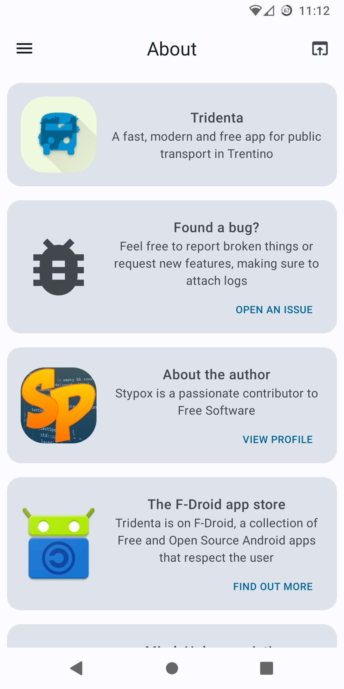
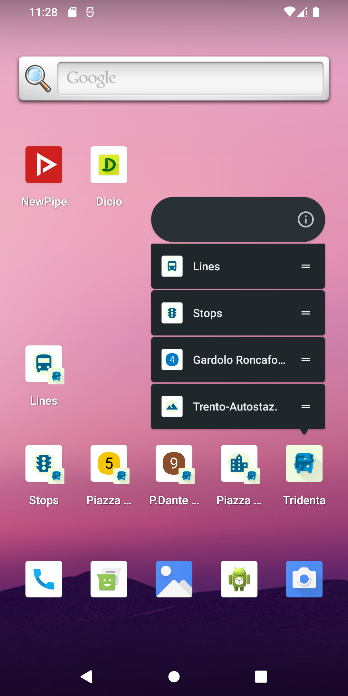

# Tridenta

An Android app that loads and shows the **local transportation** data of the italian region "*Trentino*". You can view information about **stops**, **lines** and most importantly **trips**, whose **delay** can be queried in **real time**! The shown data is the same as that shown in the official "[Muoversi In Trentino](https://www.trentinotrasporti.it/en/travel-with-us/muoversi-en)" application, except that there are *fewer* errors and slowdowns. Tridenta has a **modern look** and was built using [Jetpack Compose](https://developer.android.com/jetpack/compose) and [Material 3](https://m3.material.io/).

    
    
    

## Screenshots

## Features

- **Stops**: view and search stops all across Trentino, and see which lines pass by a stop
- **Lines**: filter urban and suburban lines by area by choosing from a map of Trentino
- **Trips**: view trips performed by a line or passing by a stop at a specific time, with arrival times, delay, headsign and direction information
- **Favorites** and history are shown in the drawer for easy access to the lines or stops you use the most
- **Shortcuts** in your phone's application launcher can link directly to a specific screen inside Tridenta, allowing you to save even more time

## Translations

Tridenta is available in English, Italian and German.